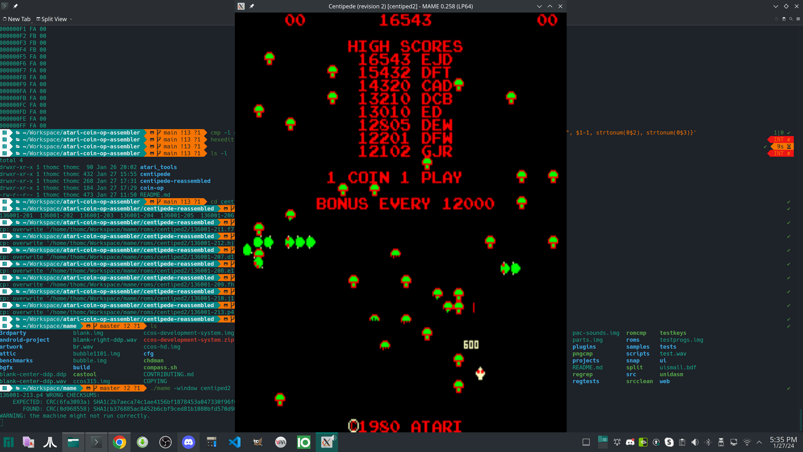

# centipede-reassembled

The re-assembled bits from centipede/revision.v2 now work as is. The problem was traced to a bug in the LINKM binary that was on disk f8. Re-building it with the source on disks e2, e3, and e4 produced an identical binary.

## Assembly

The following is output from the assembly and linking process

```
.R MAC65
*RK1:CENTI2.OBJ=CENTI2
ERRORS DETECTED: 0
FREE CORE: 14275. WORDS

*RK1:CENIR2=CENIR2
ERRORS DETECTED: 0
FREE CORE: 12969. WORDS

*RK1:CENTS2=CENTS2
ERRORS DETECTED: 0
FREE CORE: 15318. WORDS

*RK1:CENPIC=CENPIC
ERRORS DETECTED: 0
FREE CORE: 16243. WORDS

*RK1:SYNC2=SYNC2
ERRORS DETECTED: 0
FREE CORE: 16415. WORDS

^C

.R LINKM
*DK2:CENTI2,CENTI2.XX=DK1:CENTI2,CENIR2,CENTS2


*DK2:CENPIC,CENPIC.XX=DK1:CENPIC


*DK2:SYNC2,SYNC2.XX=DK1:SYNC2
^C

.
```

## IMGFIL process, and the differences

Since we do not have IMGFIL, I had to replace it with linux dd.

Once the assembly and linking were complete, the SAV files were output to the paper punch back to the PC, and the following commands were run:

```sh
$ dd if=cenpic.sav of=136001-201 bs=1 count=2048

2048+0 records in
2048+0 records out
2048 bytes (2.0 kB, 2.0 KiB) copied, 0.00303139 s, 676 kB/s

$ dd if=cenpic.sav of=136001-202 bs=1 count=2048 skip=2048 

2048+0 records in
2048+0 records out
2048 bytes (2.0 kB, 2.0 KiB) copied, 0.00295437 s, 693 kB/s

$ dd if=centi2.sav of=136001-204 bs=1 count=2048 skip=10240

2048+0 records in
2048+0 records out
2048 bytes (2.0 kB, 2.0 KiB) copied, 0.00304295 s, 673 kB/s

$ dd if=centi2.sav of=136001-205 bs=1 count=2048 skip=12288
2048+0 records in
2048+0 records out
2048 bytes (2.0 kB, 2.0 KiB) copied, 0.00306165 s, 669 kB/s

$ dd if=centi2.sav of=136001-206 bs=1 count=2048 skip=14336

2048+0 records in
2048+0 records out
2048 bytes (2.0 kB, 2.0 KiB) copied, 0.0030689 s, 667 kB/s

# For some reason, the sync ROM has 256 additional bytes of zeroes.

$ dd if=sync2.sav of=136001-213 bs=1 count=256
256+0 records in
256+0 records out
256 bytes copied, 0.000395258 s, 648 kB/s
```

### 136001-201 - CENPIC.SAV offset $0000

```sh
$ cmp -l centipede/revision.v2/136001.201 centipede-reassembled/136001-201 | gawk '{printf "%08X %02X %02X\n", $1-1, strtonum(0$2), strtonum(0$3)}' | more
```

no differences!

### 136001-202 - CENPIC.SAV offset $0800

```
$ cmp -l centipede/revision.v2/136001.202 centipede-reassembled/136001-202 | gawk '{printf "%08X %02X %02X\n", $1-1, strtonum(0$2), strtonum(0$3)}' | more
```

No differences!

### 136001-203 - CENTI.SAV offset $2000

```
$ cmp -l centipede/revision.v2/136001.203 centipede-reassembled/136001-203 | gawk '{printf "%08X %02X %02X\n", $1-1, strtonum(0$2), strtonum(0$3)}' | more
```

No differences!

### 136001-204 - CENTI.SAV offset $2800

```
$ cmp -l centipede/revision.v2/136001.204 centipede-reassembled/136001-204 | gawk '{printf "%08X %02X %02X\n", $1-1, strtonum(0$2), strtonum(0$3)}' | more
```

no differences!

### 136001-205 - CENTI.SAV offset $3000

```
$ cmp -l centipede/revision.v2/136001.205 centipede-reassembled/136001-205 | gawk '{printf "%08X %02X %02X\n", $1-1, strtonum(0$2), strtonum(0$3)}' | more
```

No differences!

### 136001-206 - CENTI.SAV offset $3800

```
$ cmp -l centipede/revision.v2/136001.206 centipede-reassembled/136001-206 | gawk '{printf "%08X %02X %02X\n", $1-1, strtonum(0$2), strtonum(0$3)}' | more
```

No differences!

## Map files

Here are the map files generated by the working and non-working links.

### Working

```
ATARI LINKM V05.00 LOAD MAP   28-MAY-81   14:19:41
BIN:CENTI2.SAV

BIN:CENTI2,CENTI2.XX=OBJ:CENTI2,CENIR2,CENTS2

File Summary:
    Name        Module  Ident   Creation Date/Time
OBJ:CENTI2      CENDEF
OBJ:CENIR2      CENDEF
OBJ:CENTS2      CENDEF

Section Summary:
 Name   Addr   Size   Attributes     References (Files):
. ABS.  0000   3366
CENIRQ  3366   06AB
CENTST  3A11   05EF

Global Symbol Summary:
 Name   Value   Name   Value   Name   Value   Name   Value   Name   Value
ABS     3833   CLRCH   2656   IRQ     3879   WRITEA  3AC9   $COINA  0C01
CHAR    383E   COMP    3835   MAIN    200E   $BC     00CB   $INTCT  00D4
CKSUM   3A11   CPYRHT  2003   MESS    37DD   $BCCNT  00CA   $LAM    0C01
CKSUM0  2058   DIGITZ  3864   MESSAG  382D   $CCTIM  00C5   $LMBIT  0010
CKSUM1  2DAE   DIGIT2  3857   MOOLAH  3366   $CMODE  00D3   $LMTIM  00D2
CKSUM2  3365   INIT    2873   RESET   3B0D   $CNCT   00C9   $PSTSL  00CC
CKSUM3  3FF9   INITAL  383B   SCORES  2D5D   $CNSTT  00CF   $$CRDT  00C8

High limit = 4000
```

### re-assembled

```
ATARI LINKM   V04-06     LOAD MAP 
CENTI2.SAV		

DK2:CENTI2,CENTI2.XX=CENTI2,CENIR2,CENTS2
(DK:CENTI2,DK:CENIR2,DK:CENTS2)


SECTION ADDR    SIZE    ENTRY   ADDR    ENTRY   ADDR    ENTRY   ADDR

. ABS.	0000	3366	$LMBIT	0010	$CCTIM	00C5	$$CRDT	00C8	
			$CNCT 	00C9	$BCCNT	00CA	$BC   	00CB	
			$PSTSL	00CC	$CNSTT	00CF	$LMTIM	00D2	
			$CMODE	00D3	$INTCT	00D4	$COINA	0C01	
			$LAM  	0C01	CPYRHT	2003	MAIN  	200E	
			CKSUM0	2058	CLRCH 	2656	INIT  	2873	
			SCORES	2D5D	CKSUM1	2DAE	CKSUM2	3365	
CENIRQ	3366	06AB	MOOLAH	3366	MESS  	37DD	MESSAG	382D	
			ABS   	3833	COMP  	3835	INITAL	383B	
			CHAR  	383E	DIGIT2	3857	DIGITZ	3864	
			IRQ   	3879	
CENTST	3A11	05EF	CKSUM 	3A11	WRITEA	3AC9	RESET 	3B0D	
			CKSUM3	3FF9	

TRANSFER ADDRESS = 0001	
HIGH LIMIT = 4000	
```

## Mapping of ROMs to EPROMs for MAME

```sh
$ cp 136001-201 ~/Workspace/mame/roms/centiped2/136001-211.f7
$ cp 136001-202 ~/Workspace/mame/roms/centiped2/136001-212.hj7
$ cp 136001-203 ~/Workspace/mame/roms/centiped2/136001-207.d1
$ cp 136001-204 ~/Workspace/mame/roms/centiped2/136001-208.e1
$ cp 136001-205 ~/Workspace/mame/roms/centiped2/136001-209.fh1
$ cp 136001-206 ~/Workspace/mame/roms/centiped2/136001-210.j1
$ cp 136001-213 ~/Workspace/mame/roms/centiped2/136001-213.p4
```

it can then be started with:

```sh
mame centiped2
```

